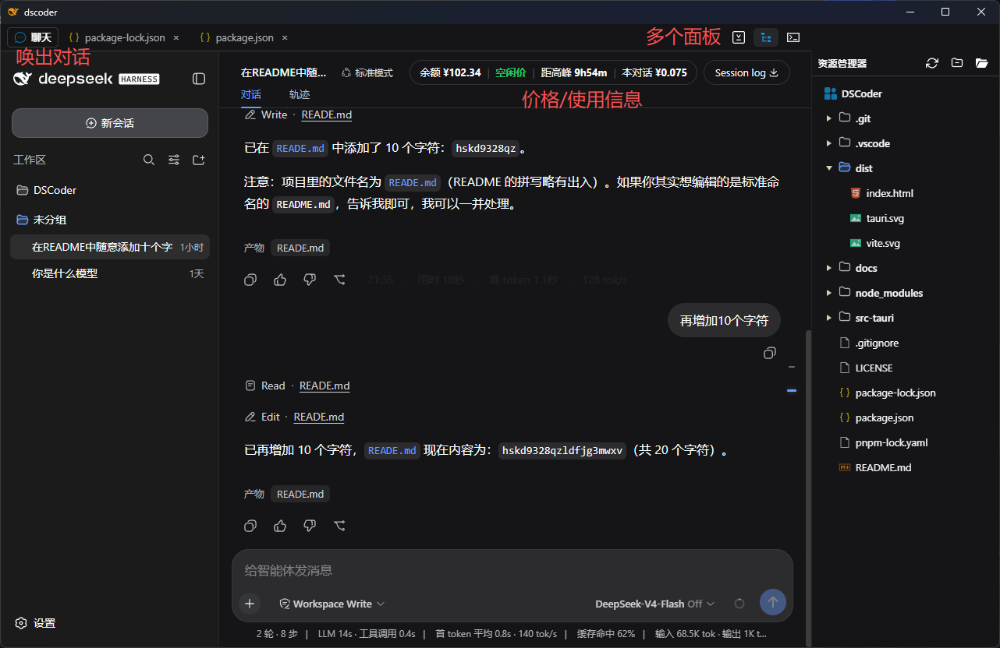
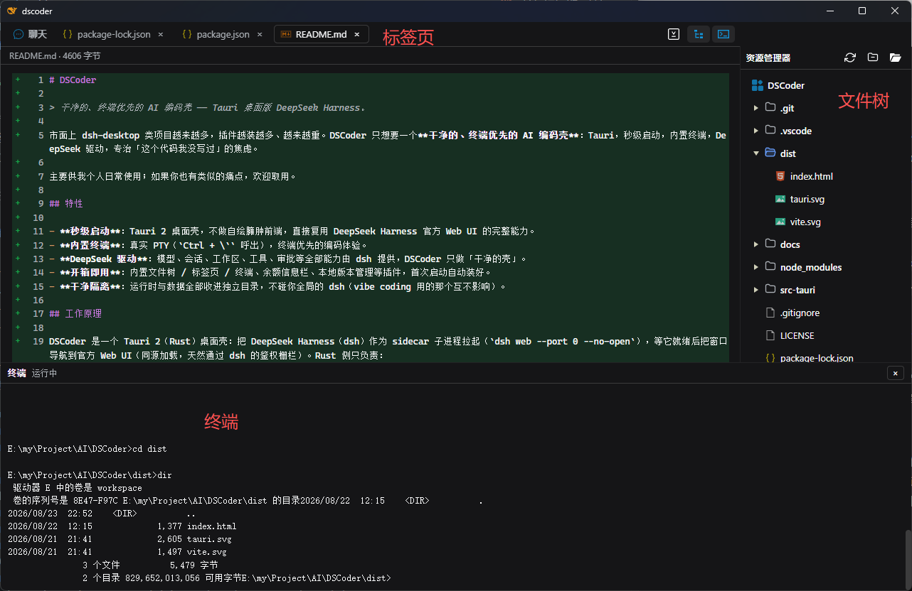
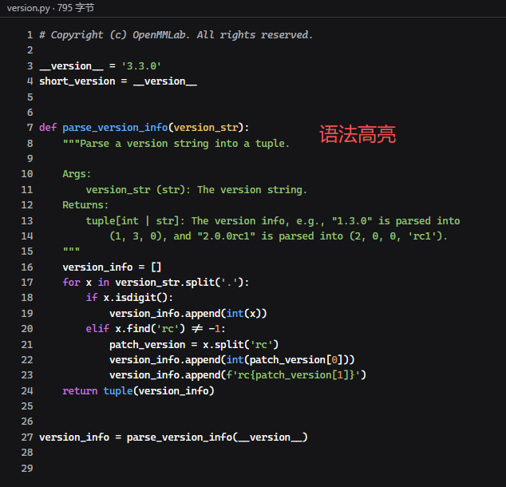
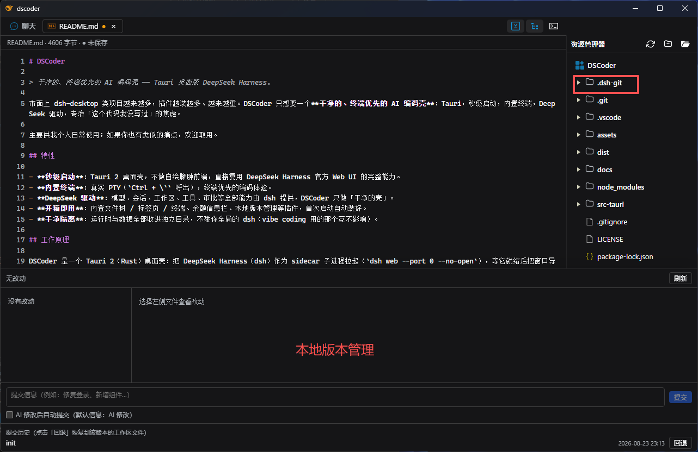

# DSCoder

> Tauri 桌面版 DeepSeek Harness —— 个人定制版。

最近重度依赖 DSH（DeepSeek Harness），但每次都得在不同设备上先打开终端再敲命令的方式启动，实在麻烦。去社区找现成的桌面套壳方案，发现很多项目确实能用，但普遍集成了大量我用不上的插件，不够清爽。

其实我也试过 VS Code 里的 DSH 插件版——毕竟我是 VS Code 的重度用户——但恰巧我刚写完一个 Tauri 项目，手正热，想再拿 Tauri 练练手巩固一下，于是决定自己写一个。

最初的版本只是个纯套壳，能把官方 Web UI 装进桌面就行。后来越用越觉得，既然壳是我自己的，不如把真正顺手的功能加进去。于是陆陆续续集成并修改了几款插件：有些来自社区的优秀参考，有些是我自己想到的点子。经过逐步打磨，才有了现在这个刚刚好、不多不少的 DSCoder。

如果你觉得这个版本也挺好，欢迎取用。

## 界面预览

| 对话界面 | 文件界面 |
| :---: | :---: |
|  |  |

| 代码高亮 | 本地版本管理 |
| :---: | :---: |
|  |  |

## 特性

- **启动快**：Tauri 桌面壳，直接复用 DeepSeek Harness 官方 Web UI 的完整能力。
- **开箱即用**：安装包内嵌 Node + dsh 运行时，目标机器免装 Node、免联网即可运行。
- **实用插件**：内置文件树 / 标签页 / 终端、余额信息栏、本地版本管理等插件，首次启动自动装好。
  - **文件树**：美观，统一风格。
  - **标签页**：第一个固定选择聊天界面，后面可以多开文件。
  - **终端**：可直接通过 `Ctrl + \`` 呼出，沉浸式工作体验，无需切换主窗口。
  - **余额信息栏**：珍惜使用Token，不要浪费。
  - **本地版本管理（BETA）**：测试版，现在可以实现基础的本地版本管理功能，仍然有提升空间。
  - **任务视图**：自动任务管理功能，设置定时任务，存储想法IDEA，进一步提升智能性。
- **自动更新**：GitHub Releases 驱动，发现新版弹窗提示，一键更新并自动重启。
- **干净隔离**：运行时与数据全部收进独立目录，不碰安装的其他 dsh。

## 工作原理

DSCoder 是一个 Tauri 桌面壳：把 DeepSeek Harness（dsh）作为 sidecar 子进程拉起（`dsh web --port 0 --no-open`），等它就绪后把窗口导航到官方 Web UI（同源加载，天然通过 dsh 的鉴权栅栏）。Rust 侧只负责：

- **运行时自动供给**：安装包内嵌 `@deepseek-ai/dsh`（默认版本 `0.1.1-rc.2`），首次启动自动解压到应用数据目录；仅开发态才联网下载。
- **进程监督**：端口发现、健康探活、崩溃退避重启、退出联动。
- **配置与凭证**：完全交给官方 UI，写入 `$DSH_HOME` 下的 `settings.yaml` 与 `.credentials.yaml`。
- **自动更新**：后台检查 GitHub Releases，原生对话框确认后下载安装并重启。

## 构建与发布

自包含打包与 GitHub Releases 自动更新，详见 [BUILD.md](BUILD.md)。

## 更新计划

1. 增加非线性会话轨迹功能
2. 把 DSH Core 版本修改为可选择，但是仍然存在默认版本。

## 感谢

本项目参考并感谢以下开源项目：

- [songoao25/dsh-bottom-info-bar](https://github.com/songoao25/dsh-bottom-info-bar) —— 内置底部信息栏插件
- [omdsh-dev/DSH-better-sidebar](https://github.com/omdsh-dev/DSH-better-sidebar) —— 侧边栏 / 文件树布局参考
- [wlj521/dsh-ui-tweaks](https://github.com/wlj521/dsh-ui-tweaks) —— 界面调整插件

## License

[Apache License 2.0](LICENSE)
